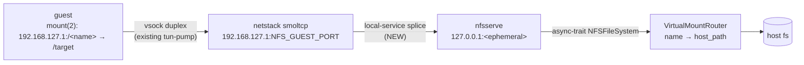
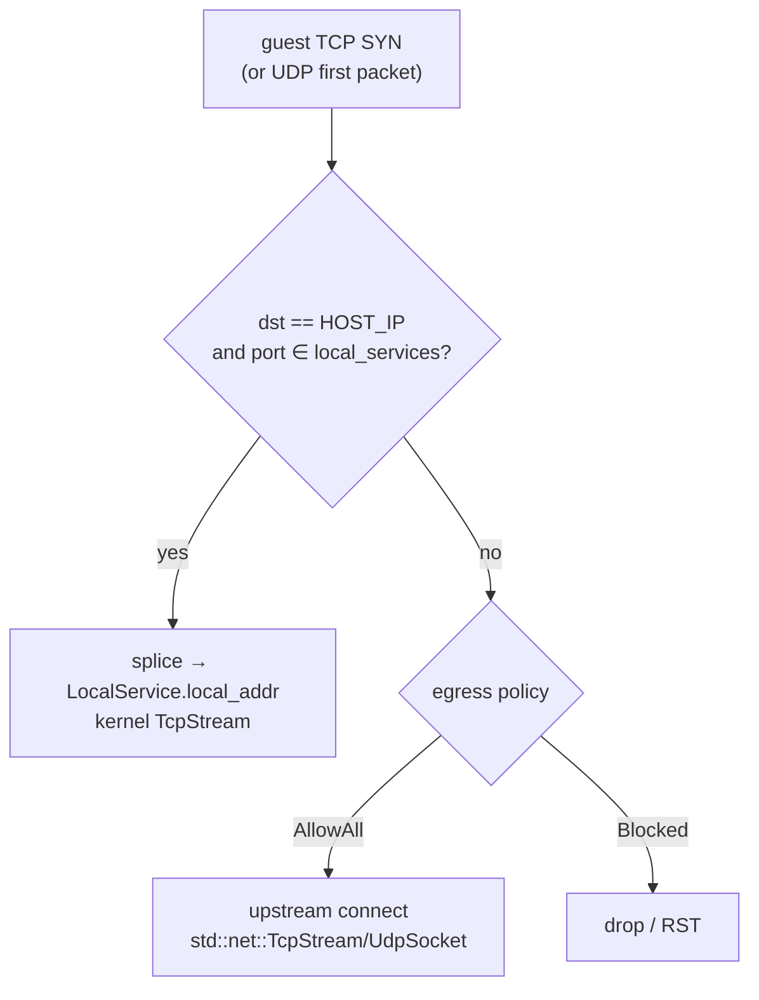

# macOS dynamic mount → NFSv3 + cross-platform always-on netstack

## Status

- [x] User approved scope (2026-05-02, revised)
- [ ] Plan reviewed
- [ ] Implementation

## What this PR delivers

Two distinct, related changes:

### 1. macOS-only: NFSv3 replaces virtio-fs + APFS-clone for ALL user mounts

Both `ConfigureParams.mounts` (boot-time) and runtime `add_mount`/`remove_mount`
go through one path: an in-process NFSv3 server (the `nfsserve` crate) that
exposes a virtual mount router. The guest mounts every share via `mount(2)`
with `fstype="nfs"`. The macOS `tokimo_dyn` virtio-fs share, the APFS clone
helper, and the per-mount `VZSingleDirectoryShare` boot devices all go away.
The only virtio-fs share that remains is `work` (the rootfs / chroot base).

### 2. Cross-platform: netstack becomes always-on, with egress policy as filter

Today `src/netstack/` only spawns when `NetworkPolicy::AllowAll`. Under
`Blocked` the netstack thread doesn't run, the guest doesn't get `tk0`, and
no in-VM traffic can reach the host gateway at all.

After this PR, netstack runs unconditionally on macOS / Windows / Linux.
`NetworkPolicy` becomes a parameter inside the netstack itself:

| Policy | What netstack does |
|---|---|
| `AllowAll` | Existing behavior: any guest TCP/UDP connect → upstream `std::net::TcpStream` / `UdpSocket` |
| `Blocked` | `register_tcp_flow` / `register_udp_flow` rejects *unless* dst matches a registered `LocalService`. ICMP echo dropped. |

**Why this is right architecturally:**

- All three platforms already share `src/netstack/mod.rs`. Linux uses it via
  `socketpair(STREAM)` fed through bwrap; macOS and Windows feed it via
  vsock duplex streams. So this is **one** code change covering three
  backends, not three.
- It enables future dynamic policy switching — `Sandbox::set_network_policy()`
  becomes tractable (just flip the egress flag at runtime).
- Required precondition for (1): the macOS NFS server must be reachable from
  the guest under `Blocked`, since `add_mount` is supposed to work in
  any policy.
- Removes ~3 codepaths: `tokimo.net=blocked` cmdline branch, the
  `if matches!(network, AllowAll)` wrapper around every netstack setup site,
  the bwrap-side conditional skip of tun-pump in init.

**Linux's `--unshare-net` is preserved** — it's the kernel-level isolation
primitive, orthogonal to whether smoltcp runs. tk0 still lives inside the
unshared netns; only the policy gating moves into smoltcp.

## Architecture (macOS dynamic mount)



## Architecture (netstack policy split)



## Decisions (locked)

| # | Decision | Source |
|---|---|---|
| 1 | NFSv3 via `nfsserve` crate (huggingface fork) | Only mature Rust v3/v4 server is v3; v4 zero options |
| 2 | All mounts (boot + runtime) on macOS go through NFS | User: "也走 NFS（全部 mount 走同一路径）" |
| 3 | Always-on netstack across macOS/Windows/Linux, egress as filter | User: "blocked 全部启动就好了，只在出口拦截" |
| 4 | Linux retains `--unshare-net` (kernel isolation primitive) | Defensive: kernel netns isolation > smoltcp filter |
| 5 | Guest mount via `mount(2)` syscall (no `mount.nfs` userspace) | User chose; smaller initrd, no fork |
| 6 | New `MountNfs` / `UnmountNfs` ops in protocol | User chose; cleaner than overloading `AddMount` |
| 7 | `PROTOCOL_VERSION` 2 → 3 (no back-compat) | User: "都没上线呢" |
| 8 | Single commit, no phasing | User: "一口气改到麱" |
| 9 | NFS server is **macOS-only** (Linux/Windows mount path untouched) | User: "nfs只针对macOS" |

## File-by-file change list

### Host side

**`Cargo.toml`** — macOS deps:
```toml
[target.'cfg(target_os = "macos")'.dependencies]
nfsserve = "0.11"
async-trait = "0.1"
```
(`tokio` is already there; `nfsserve` brings its own tokio feature flags.)

**`src/netstack/mod.rs`** — refactor:

```rust
#[derive(Clone, Copy, Debug, Eq, PartialEq)]
pub enum EgressPolicy {
    /// Existing behavior: open kernel sockets to arbitrary upstream destinations.
    AllowAll,
    /// Drop everything except registered LocalServices.
    Blocked,
}

#[derive(Clone, Debug)]
pub struct LocalService {
    pub host_port: u16,        // port guest dials at HOST_IP / HOST_IP6
    pub local_addr: SocketAddr, // splice target (typically 127.0.0.1:N)
}

pub fn spawn(
    read_half: Box<dyn Read + Send>,
    write_half: Box<dyn Write + Send>,
    shutdown: Arc<AtomicBool>,
    egress: EgressPolicy,                  // NEW
    local_services: Vec<LocalService>,     // NEW
) -> JoinHandle<()> { ... }
```

Implementation:
- `register_tcp_flow` checks `local_services` first; if hit, splice target =
  its `local_addr`. Otherwise, if `egress == Blocked`, **don't** create the
  flow (smoltcp socket is closed immediately → guest sees RST). Else
  upstream connect (current behavior).
- `register_udp_flow` analogous; under Blocked just don't bind upstream socket.
- `handle_icmpv4_echo` / `handle_icmpv6_echo`: under Blocked, drop.
- Top-of-file doc comment rewritten (delete "AllowAll only" claim).

**`src/macos/nfs.rs`** (NEW):

```rust
pub struct NfsServer {
    pub local_port: u16,           // ephemeral 127.0.0.1 port
    router: Arc<VirtualMountRouter>,
    runtime: Arc<Runtime>,         // shared with backend
    shutdown: oneshot::Sender<()>,
}

pub struct VirtualMountRouter {
    mounts: RwLock<HashMap<String, MountEntry>>,
    fileid_alloc: AtomicU64,        // monotonic
    fh_seed: u64,                   // randomized at startup; mixed into fileids
}

struct MountEntry {
    host_path: PathBuf,
    read_only: bool,
    root_fileid: u64,               // stable per-session id for /<name>/
}

impl NfsServer {
    pub fn start(runtime: Arc<Runtime>) -> Result<Self> { ... }
    pub fn add_mount(&self, name: &str, host: PathBuf, read_only: bool) -> Result<u64> { ... }
    pub fn remove_mount(&self, name: &str) -> Result<()> { ... }
    pub fn shutdown(self) { ... }
}

#[async_trait::async_trait]
impl nfsserve::vfs::NFSFileSystem for VirtualMountRouter {
    fn capabilities(&self) -> VFSCapabilities { VFSCapabilities::ReadWrite }
    fn root_dir(&self) -> fileid3 { ROOT_ID }
    async fn lookup(&self, dirid, filename) -> Result<fileid3, nfsstat3>;
    async fn getattr(&self, id) -> Result<fattr3, nfsstat3>;
    async fn read(&self, id, offset, count) -> Result<(Vec<u8>, bool), nfsstat3>;
    async fn write(&self, id, offset, data) -> Result<fattr3, nfsstat3>;
    async fn create(&self, dirid, filename, attr) -> Result<(fileid3, fattr3), nfsstat3>;
    async fn create_exclusive(&self, ...) -> Result<fileid3, nfsstat3>;
    async fn mkdir(&self, ...) -> Result<(fileid3, fattr3), nfsstat3>;
    async fn remove(&self, dirid, filename) -> Result<(), nfsstat3>;
    async fn rename(&self, ...) -> Result<(), nfsstat3>;
    async fn readdir(&self, dirid, start_after, max_entries) -> Result<ReadDirResult, nfsstat3>;
    async fn setattr(&self, id, setattr) -> Result<fattr3, nfsstat3>;
    async fn readlink(&self, id) -> Result<nfspath3, nfsstat3>;
    async fn symlink(&self, ...) -> Result<(fileid3, fattr3), nfsstat3>;
}
```

**fileid encoding** (avoid stat() inode collisions across mounts):
```text
fileid3 = (mount_index: u16) << 48 | (path_hash: u48)
```
where `path_hash = SipHash24(fh_seed, relative_path)`. Stable across calls
(SipHash is keyed). Per-mount inode-cache resolves fileid → real path on
each operation.

**File handle (`nfs_fh3`)**: 8-byte big-endian fileid. nfsserve's
`fh3_to_id`/`id_to_fh3` glue lets us choose any encoding.

**Lifetime**: NfsServer owns its tokio task; `shutdown` aborts it and drops
the `tokio::net::TcpListener`. Per-session instance — multiple concurrent
sandboxes get their own server on different ephemeral ports. Listener bound
to `127.0.0.1:0`.

**`src/macos/sandbox.rs`** — surgery:

| Remove | Replace with |
|---|---|
| `apfs_clone()` helper, `session_dir`, `dyn_root` | `NfsServer` instance |
| `RunningState.dyn_shares` HashMap | `RunningState.nfs: NfsServer` |
| `RunningState.boot_share_names` set | router rejects duplicates by name |
| `guest_mount_virtiofs(DYN_SHARE_TAG, ...)` | gone |
| Per-`Mount` virtio-fs in `start_vm` | `nfs.add_mount(...)` + `MountNfs` op for each |
| `add_mount`: clone+chmod+guest mount | `nfs.add_mount(name, host, ro)` + `MountNfs` op |
| `remove_mount`: guest umount + rm clone | `UnmountNfs` op + `nfs.remove_mount(name)` |
| `start_vm`: `if AllowAll { spawn netstack }` | unconditional spawn with `EgressPolicy` derived from policy |

**`src/macos/vm.rs`** — surgery:
- `VmConfig.dyn_root: PathBuf` → removed.
- `VmConfig.mounts: Vec<Mount>` → removed (mounts post-boot via NFS).
- `DYN_SHARE_TAG`, `DYN_SHARE_GUEST_PATH` → removed.
- VM config builder: only the `work` (rootfs) virtio-fs share remains.
- Cmdline: drop the AllowAll-vs-Blocked branch; always
  `tokimo.net=netstack`. Drop `tokimo.netstack_port` (use a constant).
- `netstack_listener` is always allocated.

**`src/windows/sandbox.rs`** — minor:
- Remove `if matches!(network, AllowAll)` guard around netstack spawn.
- Always pass `EgressPolicy::AllowAll`/`::Blocked` derived from config.

**`src/linux/sandbox.rs`** — minor:
- Always allocate the network socketpair, always feed `net_host_end` to
  `netstack::spawn`. Pass policy.
- Always pass tk0 setup args to init regardless of policy.
- `--unshare-net` retained.

**`src/protocol/types.rs`** — additions:
```rust
pub const PROTOCOL_VERSION: u32 = 3;

pub enum Op {
    // ... existing ops ...
    MountNfs {
        id: String,
        name: String,
        server_ip: String,    // typically "192.168.127.1"
        server_port: u16,     // guest-visible NFS port (constant)
        export: String,       // "/<name>"
        target: String,       // guest mountpoint
        read_only: bool,
    },
    UnmountNfs {
        id: String,
        name: String,
    },
}
```

**`src/bin/tokimo-sandbox-init/server.rs`** — handle new ops:
- Maintain `nfs_mounts: HashMap<String, PathBuf>` registry.
- `MountNfs`: `mkdir -p target`; build option string; call
  `nix::mount::mount(Some(format!("{server_ip}:{export}")), target,
   Some("nfs"), MsFlags::empty(), Some(opts))`. Insert into registry.
- `UnmountNfs`: lookup; `umount2(target, MNT_DETACH)`; `rmdir target`
  (best-effort).

NFS mount option string (canonical, conservative):
```text
nolock,vers=3,proto=tcp,port=NNN,mountport=NNN,addr=192.168.127.1,
hard,timeo=600,retrans=2,actimeo=120,wsize=1048576,rsize=1048576
```

**`packaging/vm-base/init.sh`** — simplify:
- Drop the `tokimo.net=blocked` branch entirely.
- tk0 + tun-pump always start.
- DNS / default route still gated by an explicit guest-side flag (we keep
  that off under Blocked so resolv.conf doesn't lie).

**`src/bin/tokimo-tun-pump/main.rs`** — no real change; runs the same
regardless of policy.

### Tests / docs

**`tests/sandbox_integration.rs`**:
- Remove `#[cfg_attr(target_os = "macos", ignore = ...)]` from
  `add_user_with_reverse_mount_writes_to_host`.
- (Optional) add a focused NFS test: `add_mount → guest writes → host reads`.
- Verify the existing `blocked_*` network tests still pass (smoltcp egress
  filter must reject like `--unshare-net` did).

**`docs/macos-testing.md`**:
- Delete "Known limitation: reverse-mount on macOS" section.
- Add a short "Dynamic mounts via NFSv3" paragraph.

**`CLAUDE.md`** / **`.github/copilot-instructions.md`**:
- Update macOS architecture diagram (no more `tokimo_dyn`).
- Update networking note ("netstack always-on, EgressPolicy gates upstream").

## Risks

| Risk | Mitigation |
|---|---|
| `nfsserve` correctness on rare ops (rename, hardlink, ACL) | Run focused tests; fork-and-patch if needed (BSD-3) |
| Linux egress regression (current `--unshare-net` Blocked vs new smoltcp filter) | Keep `--unshare-net` so kernel-level isolation is untouched; smoltcp filter is belt-and-suspenders |
| macOS NFS-over-smoltcp performance for large reads | Bump tx_buf to 256 KiB on local-service flows; option `rsize=1048576,wsize=1048576` |
| mount(2) NFS option string differs across kernel versions | Use canonical conservative set; test against the rootfs we ship |
| Tokio runtime drop ordering on macOS (`runtime` must outlive `vm`) | NfsServer holds its own `Arc<Runtime>` clone; same pattern as `RunningState.runtime` |
| Concurrent sandboxes within one process | NfsServer binds ephemeral port, nfsserve has no global state, smoltcp interface is per-spawn |
| I can't run Linux/Windows integration tests locally | I'll `cargo build --target` for each; user runs full integration on those platforms post-PR |

## Scope explicitly NOT included

- NFS for Linux/Windows mounts (still Plan9 / bwrap-bind).
- NFSv4 server.
- Performance benchmarking beyond making tests pass.
- Removing `--unshare-net` on Linux.
- Public dynamic `set_network_policy()` API (groundwork only).

## Implementation order (single commit at the end)

1. `src/protocol/types.rs`: bump version, add ops.
2. `src/netstack/mod.rs`: add `EgressPolicy` + `LocalService`, refactor `spawn` signature.
3. Each backend's `start_vm`/`run_bwrap` adapted to new `spawn` signature; netstack always-on.
4. `src/macos/nfs.rs` new module.
5. `src/macos/{sandbox,vm}.rs` rewrite (mounts + always-on).
6. `packaging/vm-base/init.sh` simplification.
7. Init server: MountNfs/UnmountNfs handlers.
8. Tests: unlock + new NFS-specific test.
9. Docs.

## 用户交互记录

- (2026-05-02) 用户提议照搬 OrbStack NFS 方案。
- (2026-05-02) 协议: NFSv4 Rust 生态空白，确认 NFSv3 + nfsserve crate.
- (2026-05-02) 传输: 复用 `src/netstack/`；A 方案（拆 netstack 始终启动）。
- (2026-05-02) PR 范围: NFS server + 接通 add/remove + 删 APFS-clone + 解锁测试 + 改文档.
- (2026-05-02) Guest 挂载: init 直接 mount(2)，不依赖 mount.nfs.
- (2026-05-02) Blocked 处理: 用户指出"全部启动+出口拦截"最简洁，三平台统一受益；NFS 仅 macOS。
- (2026-05-02) 提交: 单 commit，PROTOCOL_VERSION 升 2→3，无兼容性顾虑。
- (2026-05-02) Boot mounts: 也走 NFS，所有 mount 同一路径。
- (2026-05-02) 用户指出 netstack 已三平台统一（确认无误），网络改动惠及全部三平台。
- (2026-05-02) Phase 1-3 完成 (protocol+netstack+callers)，3 target compile clean。用户决定 Linux/Win **本 PR 内一起改成 always-on netstack + EgressPolicy 过滤**（不延后）。Linux Blocked 仍用 `--unshare-net` 拿到独立 netns，但 spawn netstack 不再 gated on AllowAll；Windows 同理。无法本地验证 Linux/Windows 集成，需用户在目标机器跑测试。
