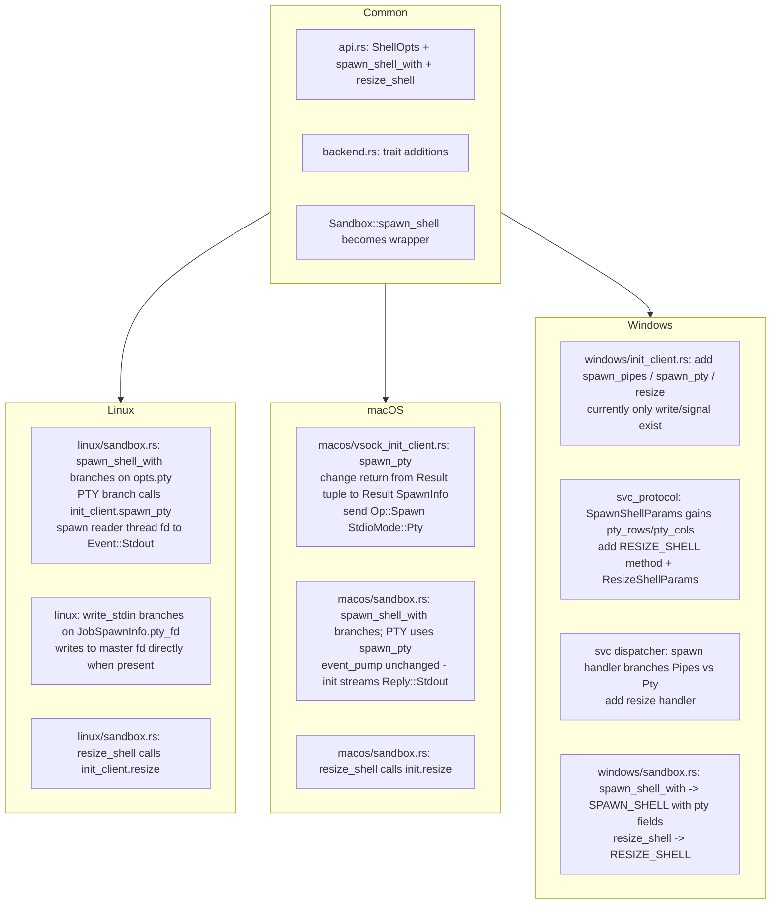

# PTY Support — Shell-Mode Approach (Revised)

> **Why this rewrite.** The previous draft (archived as
> `pty-api-cross-platform.OLD.md`) assumed a generic `spawn()` /
> `exec()` foundation in `SandboxBackend`. There is none — the public
> API is, and after auditing the integration tests should remain,
> **shell-centric**. This plan therefore models PTY as a *mode of an
> existing shell* rather than a separate `PtyHandle` type, reusing 100%
> of the per-`JobId` event/signal/lifecycle plumbing already exercised
> by `tests/sandbox_integration.rs`.

## Context

Need SSH-like interactive terminal access (xterm.js + WebSocket
frontend) on all three platforms (Linux, macOS, Windows).

PTY semantics required by xterm.js:
- combined byte stream (stdin / stdout merged on the slave side)
- terminal escape codes (colours, cursor)
- terminal resize (`TIOCSWINSZ` + `SIGWINCH`)
- Ctrl-C / job-control via the slave's controlling TTY

## What the tests already prove is in place

[tests/sandbox_integration.rs](../tests/sandbox_integration.rs) covers
`JobId`-keyed isolation end-to-end on all three platforms:

| Capability | Test | File |
|---|---|---|
| Per-shell stdout stream tagged by `JobId` | `multi_shell_isolated_streams` | [tests/sandbox_integration.rs](../tests/sandbox_integration.rs#L518) |
| Per-shell signal scoping | `multi_shell_independent_signals` | [tests/sandbox_integration.rs](../tests/sandbox_integration.rs#L562) |
| `spawn_shell` / `close_shell` / `list_shells` lifecycle | `list_shells_tracks_lifecycle` | [tests/sandbox_integration.rs](../tests/sandbox_integration.rs#L607) |
| `write_stdin(&id, ...)` per-shell | `shell_runs_multiple_commands` | [tests/sandbox_integration.rs](../tests/sandbox_integration.rs#L123) |
| Wire path: host → svc → init → `killpg(SIG)` | `signal_shell_delivers_sigint` | [tests/sandbox_integration.rs](../tests/sandbox_integration.rs#L317) |

The only missing semantics are: **(a)** "spawn this shell with a
controlling TTY of size (rows, cols)" and **(b)** "resize an existing
PTY shell". Everything else (stdin write, stdout events, signal, close)
is reused unchanged.

## Design — PTY as a shell *mode*

Replace the current zero-arg `spawn_shell()` with an options-taking
version. No backward-compat shim.

```rust
// src/api.rs
#[derive(Debug, Clone, Default)]
pub struct ShellOpts {
    /// `Some((rows, cols))` → allocate a PTY pair, dup slave to
    /// stdin/stdout/stderr, set the slave as the child's controlling
    /// terminal. `None` → pipes mode (separate stdin/stdout/stderr).
    pub pty: Option<(u16, u16)>,
    /// Optional argv override. `None` → default login shell.
    pub argv: Option<Vec<String>>,
    /// Optional env overlay applied on top of the session-wide env.
    pub env: Vec<(String, String)>,
    /// Optional initial cwd; defaults to `/work`.
    pub cwd: Option<String>,
}

impl Sandbox {
    /// Spawn a shell. The boot shell created by `start_vm()` always uses
    /// `ShellOpts::default()` (pipes mode) and is exposed via `shell_id()`.
    pub fn spawn_shell(&self, opts: ShellOpts) -> Result<JobId> { ... }
    pub fn resize_shell(&self, id: &JobId, rows: u16, cols: u16) -> Result<()> { ... }
}
```

All existing callers update from `spawn_shell()` →
`spawn_shell(ShellOpts::default())`. Tests in
`tests/sandbox_integration.rs` need the same one-line change in
~3 places (`multi_shell_*`, `list_shells_tracks_lifecycle`).

### Cross-platform user code (identical on all three)

```rust
let id = sb.spawn_shell_with(ShellOpts {
    pty: Some((24, 80)),
    ..Default::default()
})?;
sb.write_stdin(&id, b"vim README.md\n")?;     // existing API
// Stdout (with escape codes) arrives via the existing subscribe() stream.
sb.resize_shell(&id, 50, 120)?;                // new
sb.write_stdin(&id, b"\x03")?;                 // Ctrl-C as a slave-side byte
sb.close_shell(&id)?;                          // existing API
```

### Critical architectural decision: Linux also routes through events

Linux's `init_client::spawn_pty` returns `(SpawnInfo, OwnedFd)` — the
master fd via `SCM_RIGHTS`. There are two ways to expose it:

1. Hand the master fd to the user (the abandoned draft's approach).
2. **Host-side reader thread** that drains the master fd and emits
   `Event::Stdout { id, data }`, mirroring the `init`-side relay used
   by macOS/Windows stream transports.

**Pick (2).** It makes the user-visible behaviour identical on all
three platforms: every byte from the slave shows up as `Event::Stdout`
events keyed by the shell's `JobId`, and `write_stdin` writes to the
master fd. The xterm.js / WebSocket bridge becomes a single
platform-agnostic loop — no `cfg(target_os = "linux")` branches in
user code.

`stderr` is not produced separately in PTY mode (slave merges them);
`Event::Stderr` simply never fires for PTY shells.

---

## Per-platform increments



### Linux (`src/linux/`)

1. **`sandbox.rs`** — `JobSpawnInfo.pty_fd` field already exists
   ([linux/sandbox.rs](../src/linux/sandbox.rs#L61)). In
   `spawn_shell_with`:
   - `None` → existing path: `init_client.spawn_shell(...)`.
   - `Some((rows, cols))` →
     `init_client.spawn_pty(argv, env, cwd, rows, cols)` returns
     `(SpawnInfo, OwnedFd)`. Store fd in `pty_fd`. Spawn a dedicated
     reader thread:
     ```rust
     let fd_clone = nix::unistd::dup(&master_fd)?;
     let job = job_id.clone();
     let senders = event_senders.clone();
     thread::spawn(move || {
         let mut f = std::fs::File::from(fd_clone);
         let mut buf = [0u8; 8192];
         loop {
             match f.read(&mut buf) {
                 Ok(0) | Err(_) => break,
                 Ok(n) => broadcast(
                     &senders,
                     Event::Stdout { id: job.clone(), data: buf[..n].to_vec() },
                 ),
             }
         }
     });
     ```
   - `write_stdin(&id, ...)` checks `pty_fd`: if `Some`, writes to the
     master fd; else uses the existing pipe path.
   - `close_shell(&id)`: if `pty_fd` present, drop the fd before signal
     (closes master, slave gets EOF, child exits naturally).

2. **`init_client.rs`** — commit `33b2be4` removed the previously-existing
   `spawn_pty` / `resize` / pipe-spawn helpers as "dead code". They
   need to be re-added now that PTY is becoming a live feature. Add:
   ```rust
   pub fn spawn_pty(
       &self,
       argv: &[String],
       env: &[(String, String)],
       cwd: Option<&str>,
       rows: u16,
       cols: u16,
   ) -> Result<(SpawnInfo, OwnedFd)>;

   pub fn resize(&self, child_id: &str, rows: u16, cols: u16) -> Result<()>;
   ```
   The init server already handles `StdioMode::Pty` and `Op::Resize`
   ([server.rs](../src/bin/tokimo-sandbox-init/server.rs#L1347)) — the
   wire protocol is intact, only the host-side client conveniences
   were trimmed. `spawn_pty` recovers the master fd via SCM_RIGHTS on
   the SEQPACKET reply (existing init server behaviour).

3. **`backend.rs`** — implement `resize_shell` calling
   `init_client.resize(child_id, rows, cols)`.

### macOS (`src/macos/`)

1. **`vsock_init_client.rs`** — commit `9e54406` removed the previous
   `spawn_pty` / `resize` helpers as "dead code" alongside Linux's
   parallel cleanup. Currently only `spawn_pipes` / `write` / `signal`
   exist. Add (mirroring Linux):
   ```rust
   pub fn spawn_pty(
       &self,
       argv: &[String],
       env: &[(String, String)],
       cwd: Option<&str>,
       rows: u16,
       cols: u16,
   ) -> Result<SpawnInfo>;          // no fd over VSOCK

   pub fn resize(&self, child_id: &str, rows: u16, cols: u16) -> Result<()>;
   ```
   Both use the existing `spawn_ack` / `ack_op` helpers — just send
   `Op::Spawn { stdio: StdioMode::Pty { rows, cols } }` and `Op::Resize`.
   The init server's stream-bridged PTY relay already converts master-fd
   reads into `Reply::Stdout { child_id, data }` chunks.

2. **`sandbox.rs`** — `spawn_shell` branches on `opts.pty`. PTY children's
   stdout flows through the existing `event_pump_loop` → `Event::Stdout`.
   No `pty_children` exclusion set is needed (everything is uniform).

3. **`resize_shell`** — call new `init.resize(child_id, rows, cols)`.

### Windows (largest gap)

1. **`windows/init_client.rs`** — currently only `write` and `signal`
   exist. Add:
   ```rust
   pub fn spawn_pipes(
       &self,
       argv: &[String],
       env: &[(String, String)],
       cwd: Option<&str>,
   ) -> Result<SpawnInfo>;

   pub fn spawn_pty(
       &self,
       argv: &[String],
       env: &[(String, String)],
       cwd: Option<&str>,
       rows: u16,
       cols: u16,
   ) -> Result<SpawnInfo>;

   pub fn resize(&self, child_id: &str, rows: u16, cols: u16) -> Result<()>;
   ```
   Mirror the Linux/macOS init-client pattern — send `Op::Spawn` /
   `Op::Resize` over the existing pipe tunnel and await ack/reply.

2. **`svc_protocol.rs`** — extend, do **not** add parallel methods:
   ```rust
   #[derive(Serialize, Deserialize)]
   pub struct SpawnShellParams {
       #[serde(default)] pub pty_rows: Option<u16>,
       #[serde(default)] pub pty_cols: Option<u16>,
       #[serde(default)] pub argv: Option<Vec<String>>,
       #[serde(default)] pub env: Vec<(String, String)>,
       #[serde(default)] pub cwd: Option<String>,
   }

   pub mod method {
       pub const RESIZE_SHELL: &str = "resizeShell";   // new
   }

   #[derive(Serialize, Deserialize)]
   pub struct ResizeShellParams {
       pub id: String,            // JobId of the shell
       pub rows: u16,
       pub cols: u16,
   }
   ```
   Bump `PROTOCOL_VERSION` to 4 (additive — `pty_rows/cols` default to
   `None`, old clients keep working).

3. **Service dispatcher**
   (`src/bin/tokimo-sandbox-svc/imp/mod.rs`) — extend the `SPAWN_SHELL`
   handler: if both `pty_rows` and `pty_cols` are `Some`, call
   `WinInitClient::spawn_pty` (else `spawn_pipes`). Add `RESIZE_SHELL`
   handler dispatching to `WinInitClient::resize`.

4. **`windows/sandbox.rs`** — `spawn_shell_with` sends `SPAWN_SHELL`
   with the new fields populated; `resize_shell` sends `RESIZE_SHELL`.

---

## Backend trait changes (`src/backend.rs`)

Replace the old signature outright:

```rust
// before:
// fn spawn_shell(&self) -> Result<JobId>;

// after:
fn spawn_shell(&self, opts: ShellOpts) -> Result<JobId>;
fn resize_shell(&self, id: &JobId, rows: u16, cols: u16) -> Result<()>;
```

All three backend impls (`linux/sandbox.rs`, `macos/sandbox.rs`,
`windows/sandbox.rs`) update accordingly. The boot shell branch
(`start_vm` auto-spawn) calls `spawn_shell(ShellOpts::default())`
internally.

---

## Implementation order

1. `src/api.rs` — `ShellOpts`, replace `Sandbox::spawn_shell` signature, add `resize_shell`
2. `src/backend.rs` — replace trait `spawn_shell` signature, add `resize_shell`
3. `src/linux/sandbox.rs` — branch on `opts.pty`, reader thread,
   master-fd write path, `resize_shell`
4. `src/macos/vsock_init_client.rs` — wire up `spawn_pty`
   (drop `not_implemented`)
5. `src/macos/sandbox.rs` — branch on `opts.pty`, hook `resize_shell`
6. `src/svc_protocol.rs` — extend `SpawnShellParams`, add
   `RESIZE_SHELL` + params, bump version
7. `src/windows/init_client.rs` — `spawn_pipes` / `spawn_pty` / `resize`
8. `src/bin/tokimo-sandbox-svc/imp/mod.rs` — branch in spawn handler,
   add resize handler
9. `src/windows/sandbox.rs` — populate new fields, add `resize_shell`
10. New tests in `tests/sandbox_integration.rs` (see below)

---

## Verification

`cargo build` + `cargo test` on all three targets, plus new integration tests:

### `pty_shell_reports_correct_size`
Spawn shell with `pty: Some((40, 132))`. `write_stdin "stty size\n"`.
Drain stdout. Assert it contains `"40 132"`.

### `pty_shell_resize_propagates`
Spawn `pty: Some((24, 80))`. Send `stty size`, expect `24 80`.
Call `resize_shell(50, 120)`. Send `stty size` again, expect `50 120`.

### `pty_shell_ctrl_c_does_not_kill_shell`
Spawn `pty: Some((24, 80))`. Park bash in `sleep 60`. After ≥500ms
send `write_stdin b"\x03"` (raw Ctrl-C byte to the slave). Then send
`echo ALIVE\n`. Drain — must see `ALIVE`. **Key contrast** with the
existing `signal_shell_delivers_sigint` (which kills the pipe-mode
shell entirely).

### `pty_shell_color_escape_codes_pass_through`
Spawn `pty: Some((24, 80))`. Send `printf '\e[31mRED\e[0m\n'`.
Drain — assert `\x1b[31mRED\x1b[0m` is present byte-exact.

### Existing tests
Update ~3 call sites of `spawn_shell()` →
`spawn_shell(ShellOpts::default())` in
`multi_shell_isolated_streams`, `multi_shell_independent_signals`,
`list_shells_tracks_lifecycle`. Behaviour assertions stay identical.

---

## Out of scope

- WebSocket bridge / xterm.js framing — user wires this on top using
  `subscribe()` + `write_stdin` + `resize_shell`.
- Heredoc / multi-line paste throttling — xterm.js client-side concern.
- Terminfo selection inside the guest — guest already has
  `xterm-256color` in the rootfs.
- Per-PTY-shell PTY-vs-pipe runtime switch — once a shell is spawned in
  one mode, it stays in that mode until `close_shell`.

## 用户交互记录

- 决策：选择 ShellOpts + resize_shell 方案（三平台事件流统一），不引入 PtyHandle 第二种返回类型。
- 决策：不保留向后兼容。直接替换 `spawn_shell()` 签名为 `spawn_shell(ShellOpts)`，旧调用点更新为传 `ShellOpts::default()`。
- 调整：拉取上游后发现两个 cleanup commits同时删了三平台 init_client 中的“未使用 PTY API”：
  - `33b2be4` 删 `src/linux/init_client.rs` 的 `spawn_pty`/`resize`。
  - `9e54406` 删 `src/macos/vsock_init_client.rs` 的 `spawn_pty`/`resize`。
  Windows `src/windows/init_client.rs` 本来就没有。Wire 协议（`Op::Spawn` w/ `StdioMode::Pty`、`Op::Resize`）在 init server 端完整保留。计划随之调整：**三平台 init_client 都需要重加 `spawn_pty` + `resize` 客户端便利方法**。
