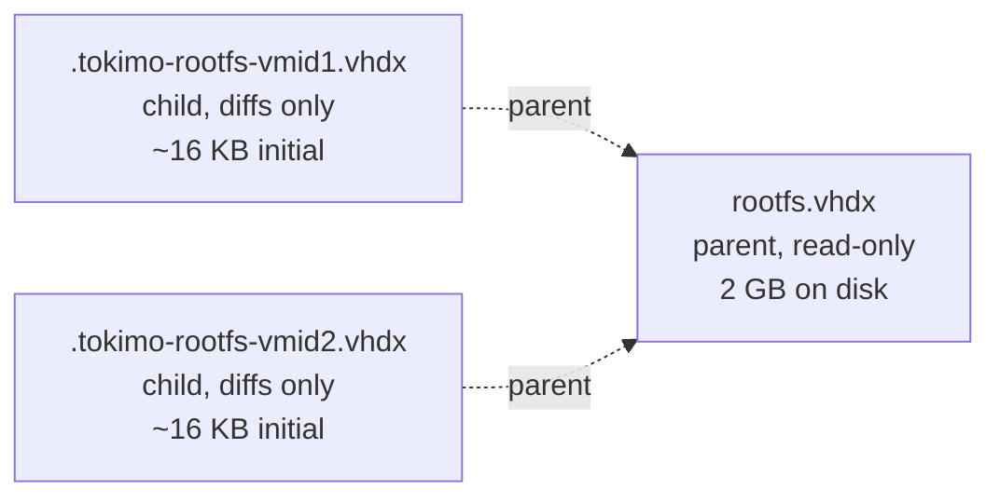

# VHDX Differencing Disk 优化

## 背景

集成测试 30 项耗时 99 秒（修了 client.rs 的 5s Hello 等待之后），其中
**每个测试 ~3s 用在 `std::fs::copy()` 全量克隆 2 GB 的 rootfs.vhdx**。

* 总写盘量：30 测试 × 2 GB ≈ **60 GB / 全量跑一次**
* 单次克隆耗时主导整个 `start_vm` 路径

[`src/bin/tokimo-sandbox-svc/imp/vhdx_pool.rs`](../src/bin/tokimo-sandbox-svc/imp/vhdx_pool.rs)
当前 `acquire_ephemeral` 实现：

```rust
let dst = scratch_dir.join(format!(".tokimo-rootfs-{vm_id}.vhdx"));
std::fs::copy(&template, &dst)?;
```

NTFS 上 `std::fs::copy` 是字节级复制，不会自动 CoW。

## 目标

把 ephemeral rootfs 克隆从 ~3 s / 2 GB 写降到 ~30 ms / 几 KB 写。

* **测试全量**：99 s → 预估 **~10 s**（30 测试 × ~0.3 s 启动 + 测试逻辑）
* **生产路径**：任何使用 `RootfsSpec::Ephemeral` 的客户端同等受益
* **架构上不破坏 API**：`vhdx_pool::acquire` 签名不变，只改内部实现

## 方案：Hyper-V VHDX 差分盘（differencing disk）

差分盘是 Hyper-V 原生支持的概念：一个 child VHDX 文件指向 parent
VHDX，所有写入只落到 child，读穿透到 parent。teardown 时删 child，
parent 保持只读纯净。



### 核心 API 选择

Windows 提供两条等价路径：

| API | 优点 | 缺点 |
|---|---|---|
| `Hyper-V` cmdlet `New-VHD -Differencing -ParentPath ...` | 现成、PowerShell 一行 | 需要外挂 PS 进程；service 是纯 Rust |
| **`virtdisk.dll` 的 `CreateVirtualDisk`** with `CREATE_VIRTUAL_DISK_FLAG_NONE` + `VIRTUAL_DISK_PARAMETERS_VERSION_2.ParentPath` | 纯 Win32 调用、和现有 HCS 风格一致 | 要写 FFI 包装，需要确保 parent VHDX 的某些 metadata（如 LogicalSectorSize）兼容 |

**选 `virtdisk.dll`**：service 已经走 `windows` crate 调 HCS，加 `virtdisk` feature
天然契合。`windows = "0.62"` 提供 `Win32_Storage_Vhd::*` 完整绑定。

### HCS schema 调整

差分盘启动时，HCS 的 `Layers` 字段仍然只挂一层（child VHDX 路径），
**HCS 自己会读 child 的 metadata 找到 parent 路径并打开它**。
不需要在 schema 里显式列 parent，但要保证：

* parent 文件路径在 child 的整个生命周期内稳定（**不能改名/移动**）
* parent 文件可读（service 跑在 SYSTEM，能读 `vm/rootfs.vhdx`）
* parent 是 dynamic 或 fixed VHDX（不是 differencing 自己）

我们的 `vm/rootfs.vhdx` 满足全部条件。

## 实施清单

### 1. `vhdx_pool.rs` — 替换 ephemeral 克隆路径

```rust
fn acquire_ephemeral(template: &Path, scratch_dir: &Path, vm_id: &str) -> Result<VhdxLease, PoolError> {
    let template = canonicalize_safe(template).map_err(...)?;
    if !template.is_file() { return Err(...); }

    let dst = scratch_dir.join(format!(".tokimo-rootfs-{vm_id}.vhdx"));
    if dst.exists() { let _ = std::fs::remove_file(&dst); }

    // OLD: std::fs::copy(&template, &dst).map_err(...)?;
    // NEW: differencing-disk creation
    create_differencing_vhdx(&template, &dst).map_err(|e| PoolError::Io(e))?;
    ...
}

fn create_differencing_vhdx(parent: &Path, child: &Path) -> Result<(), String> {
    // CreateVirtualDisk with CREATE_VIRTUAL_DISK_PARAMETERS::Version2:
    //   .ParentPath = parent
    //   .PhysicalSectorSizeInBytes = 0  (inherit from parent)
    //   .BlockSizeInBytes = 0           (inherit from parent)
    //   .UniqueId = GUID_NULL           (auto-assign)
    // VIRTUAL_STORAGE_TYPE { DeviceId = VHDX, VendorId = MICROSOFT }
    // CREATE_VIRTUAL_DISK_FLAG_NONE
    ...
    Ok(())
}
```

### 2. 依赖

`Cargo.toml` 的 windows feature 列表加 `Win32_Storage_Vhd`。

### 3. 测试覆盖

加 `tests/sandbox_integration.rs` 的诊断测试（已有 `bench_lifecycle_timing`
模板）：

* `vhdx_diffdisk_clone_under_100ms` (ignored)：assert clone 时间 < 100 ms

### 4. 兼容性回退

某些 NTFS 卷可能不支持差分盘（极罕见），或 parent 文件来自非本地存储
（CIFS/SMB）。`CreateVirtualDisk` 失败时降级回 `std::fs::copy`，并通过
`eprintln!("[svc] differencing disk failed, falling back to full clone: {e}")`
告警。

### 5. 生命周期

* **Create**：`acquire_ephemeral` 时调用 `create_differencing_vhdx`
* **Mount**：HCS schema 把 child VHDX 路径放到 `Layers[0].Path`，parent 自动 resolve
* **Teardown**：`VhdxLease::drop` 已经 `remove_file(&self.path)`，
  child 删除即彻底清理（parent 不动）

## 风险

* **parent 文件锁**：当 child 打开时，parent 是否被独占？根据微软文档
  parent 是 read-shared，多个 child 可同时打开同一 parent。需要本地
  smoke test 确认。
* **集成测试的 `vm/.rebaked` 流程**：rebake 会替换 vm/initrd.img 但
  不动 vm/rootfs.vhdx，所以 parent 不动。如果某天 rebake 也要重打
  rootfs，需要先清理所有 child。
* **磁盘碎片**：长期跑会留下大量 child 文件（如果某次 service 异常崩
  溃没清理）。`scratch_dir` 应在 service 启动时扫描并清理 stale
  `.tokimo-rootfs-*.vhdx`。

## 不在范围

* `RootfsSpec::Persistent` 路径不动 —— persistent 本来就是首次复制后
  反复复用，没有 hot path 问题
* macOS / Linux 后端不动 —— 它们用的是 virtio-fs / bind mount，没有
  VHDX 概念

## 验证标准

* `cargo test --lib` 全绿
* 集成测试 30/30 通过
* `bench_lifecycle_timing` 报 `start_vm < 500 ms`（当前 ~3000 ms）
* 全量集成耗时降到 < 30 s（目前 99 s，目标减少 ~70 s）
* `vm/rootfs.vhdx` MD5 在测试前后一致（parent 不被 child 写污）

## 参考

* Microsoft Docs: [CreateVirtualDisk function](https://learn.microsoft.com/en-us/windows/win32/api/virtdisk/nf-virtdisk-createvirtualdisk)
* `windows` crate `Win32::Storage::Vhd::CreateVirtualDisk`
* HCS Schema 2.x `VirtualMachine.Devices.Scsi[].Attachments[].Path` —— 接受任何 VHDX，包括差分盘
